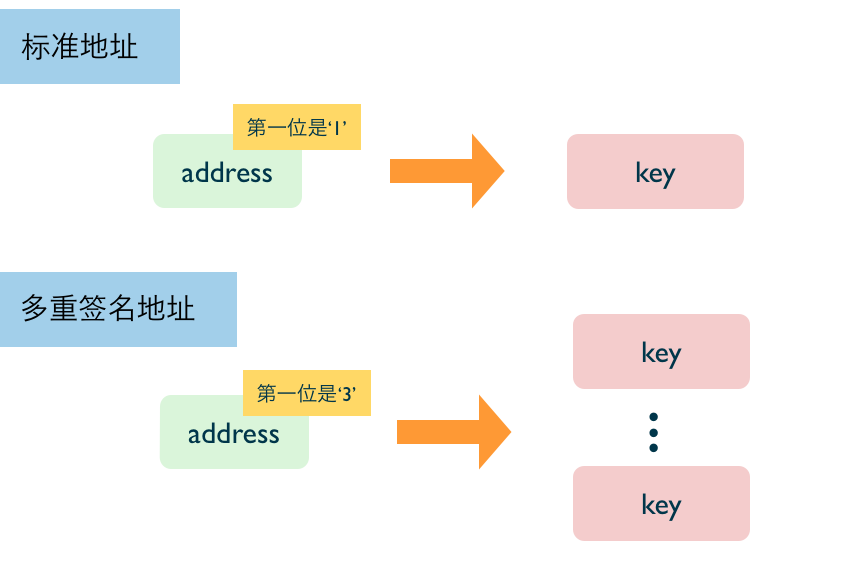

这个页面上面会列出实际我自己书中常用的一些要素。

### 三级标题

h3 是最常见的小节标题。

### 流程图

我会用 keynote 画出下面风格的流程图：

### 代码块

`console` 风格


rails -v
rails new haoqi_alipay -d mysql
cd alipay
rake db:create db:migrate # 由于我本地 mysql 没有设置密码，所以也不用修改 database.yml 文件
rails s


行间代码是这样 `local.dev:3000` 的。

`ruby` 风格


config.generators do |g|
  g.assets false
  g.helper false
  g.test_framework false
end


html 风格：


<header>
  <%= yield :head %>
</header>

  <%= yield %>



### 插图

插图风格就不一定了，什么样的都有。不过我一般喜欢白色背景的 jpg 图片。这样如果书页本身的背景也是白的，那么融入感比较好。

